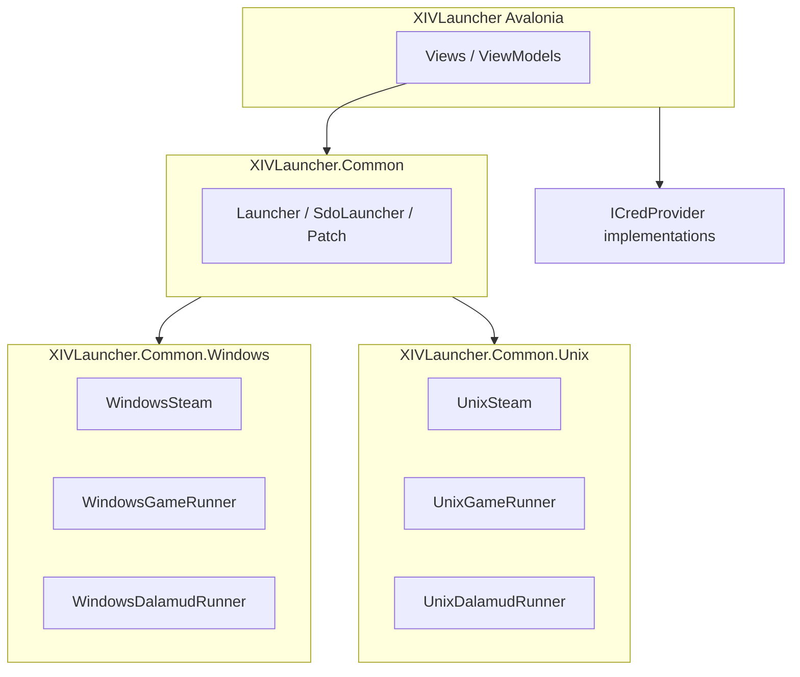

# Avalonia XIVLauncher 跨平台设计

## 1. 目的与关联文档

将当前以 Windows 为主的 **Avalonia 主程序**（`src/XIVLauncher`）演进为在 **Windows、Linux、macOS** 上可构建、可发布的同一套 UI 与业务逻辑，并与已有参考实现 [XIVLauncher.Core](https://github.com/ottercorp/XIVLauncher.Core)（ImGui + `lib/FFXIVQuickLauncher` 子模块）在架构上对齐。

- **补丁子进程**：见 [patch-installer.md](./patch-installer.md)（PatchInstaller 不必绑定 WPF；已在 Linux 环境验证过的去 WPF 方向）。

## 2. 目标与非目标

### 目标

- **单一 Avalonia 应用**：同一 `XIVLauncher` 工程面向多 `RuntimeIdentifier`（或等价多目标）发布，而非维护 Windows Avalonia + Linux/macOS Core 双 GUI（长期可减少分叉，短期工作量集中在主工程与条件编译）。
- **复用现有分层**：`XIVLauncher.Common` 承载与 OS 无关的游戏/登录/补丁逻辑；`XIVLauncher.Common.Windows` / `XIVLauncher.Common.Unix` 分别实现 `PlatformAbstractions`（`ISteam`、`IGameRunner`、`IDalamudRunner` 等）。
- **Unix 凭证**：在非 Windows 上提供与系统密钥环集成的 `ICredProvider`（参考 Core 的 **KeySharp** + `cred.json` + 现有 `EncryptionHelper`），避免仅依赖「不加密」或 Windows 凭据管理器。
- **补丁**：Linux/macOS 默认采用 **内进程** 补丁路径（与 Core 的 `PatchAsync(..., external: false)` 一致）；Windows 可保留外置 `XIVLauncher.PatchInstaller` RPC 流程作为选项。

### 非目标

- **WeGame 读 Token / SID、提权 ArgReader、`wegame://`**：不移植到 Linux/macOS；相关 UI 与程序集仅在 Windows 上可用或仅 Windows 构建包含。
- **一次替换所有 Windows 专属体验**：如快捷方式（COM）、部分注册表检测、JumpList 等可在 Unix 上降级或留空实现。

## 3. 总体架构

应用启动时根据 **运行时 OS**（或编译符号）选择具体平台实现，与 Core 的 `Program.cs` 中 `WindowsSteam` / `UnixSteam` 分支一致；主工程需从「硬编码 `new WindowsSteam()`」改为工厂或单一注册点，避免在非 Windows 上错误引用仅 Windows 可用的类型。

## 4. 工程与构建

| 项目 | 方向 |
|------|------|
| `XIVLauncher` | `TargetFramework(s)` 与 RID：支持 `linux-x64`、`osx-x64`、`win-x64`（按需扩展 `arm64`）；按需保留 `net10.0-windows` 专用于 WinRT（Windows Hello）子集，或通过多目标 `net10.0` + `net10.0-windows` 分离 Hello 代码文件。 |
| `XIVLauncher.Common` | **修正 `WIN32` 等常量**：按 **目标平台/RID** 定义，而非仅按 **构建主机 OS**，保证在 Linux CI 上为 Windows 交叉构建时语义正确。 |
| `XIVLauncher.Common.Windows` / `Unix` | 保持现有职责；主应用通过引用 + 条件或运行时分支选用。 |
| `XIVLauncher.PatchInstaller` | 平台中立 CLI：见 [patch-installer.md](./patch-installer.md)。 |
| `XIVLauncher.ArgReader` / WeGame 链 | 仅 Windows 产物或仅 Windows 条件编译/打包。 |

## 5. 密钥与 `ICredProvider`

- **保留**：`EncryptionHelper`（NSec Aegis-256 + Argon2id）、SQLite 账户字段加密契约、`cred.json`（`CredData`）结构。
- **Windows**：现有 **凭据管理器**（AdysTech）与 **Windows Hello**（WinRT）保留；Hello 相关代码必须仅在 `net10.0-windows` 或 Windows 专用文件中编译。
- **Linux/macOS**：新增基于 **KeySharp** 的实现，存储主密钥材料至 **libsecret / Keychain**，行为对齐 XIVLauncher.Core 中 `Accounts/Cred/CredProviders/CredentialManager.cs` 的思路（含 libsecret 解锁等已知注意点）。
- **Keyring 包名/服务名**：默认建议与 XIVLauncher.Core 保持一致，便于用户在两套启动器间迁移或并存时复用密钥材料；若商业/安全策略要求隔离，则使用独立命名并在发行说明中明确写出，避免无声不兼容。

## 6. WeGame（仅 Windows）

- UI：`WeGame SID`、`WeGame Token/抓包`、从 WeGame 版读取登录信息等 **仅在 `OperatingSystem.IsWindows()` 为真时显示**。
- 打包：`RemoteArgReader`、`XIVLauncher.ArgReader.exe`、`FfxivArgLauncher` 相关本地读取 **不** 纳入 Linux/macOS 发布包；`SdoLauncher` 中与 SDO API 相关的类型可保留在 Common，但 **触发 WeGame 客户端与内存读取的代码路径** 仅 Windows 可执行。

## 7. 补丁策略

- **Unix**：主程序调用 Common 中补丁管线时 **`external: false`**，内进程应用 ZiPatch。
- **Windows**：可继续支持外置 `XIVLauncher.PatchInstaller` + 共享内存 RPC；与内进程二选一或可由设置/标志切换（与现状及 Core 行为对齐即可）。
- **PatchInstaller 本身**：不要求 WPF；跨平台 CLI 形态见 [patch-installer.md](./patch-installer.md)。

## 8. 其他平台相关清理

- **`Paths` / `kernel32` 符号链接检测**：非 Windows 使用托管或 POSIX 友好实现，避免在 Linux 上 P/Invoke `kernel32`。
- **Registry、COM（IWshRuntime）、user32 窗口技巧**：限制在 Windows 分支；Unix 上降级（无桌面快捷方式创建、无部分兼容性注册表检测等）。
- **Velopack / 更新**：按各 OS 发布通道分别配置（具体渠道可放在实现计划中）。

## 9. CI 与质量

- 构建矩阵至少覆盖 **windows、linux、macOS** 上的 `dotnet build`/`publish`（与团队资源一致时可分阶段启用）。
- 自动化测试以 **Common** 与无 UI 逻辑为主；密钥环相关可在 Linux 容器做烟测（可选）。

## 10. 分阶段建议

1. **第一阶段**：构建与打包打通（多 RID、主工程引用 Unix、Steam/Runner 工厂化）；PatchInstaller 去 WPF；Common 的 `WIN32` 定义修正；Paths/明显 P/Invoke 守卫。
2. **第二阶段**：KeySharp `ICredProvider`、设置 UI、迁移与降级路径；Unix 默认内进程补丁接线。
3. **第三阶段**：WeGame/UI 与打包裁剪 polished；CI 矩阵与发行物（含依赖说明如 Linux libsecret）。

## 11. 参考

- [ottercorp/XIVLauncher.Core](https://github.com/ottercorp/XIVLauncher.Core)（`cn` 分支）：内进程补丁、KeySharp 凭证、`Program.cs` 平台分支。
